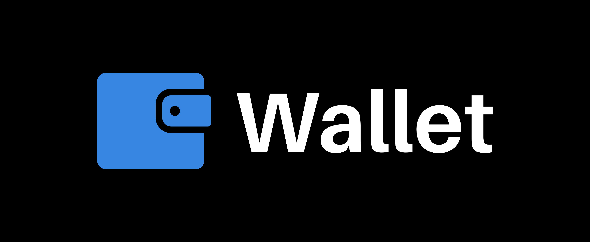
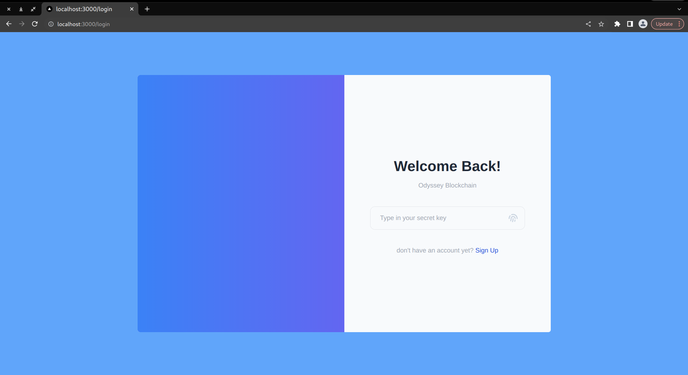
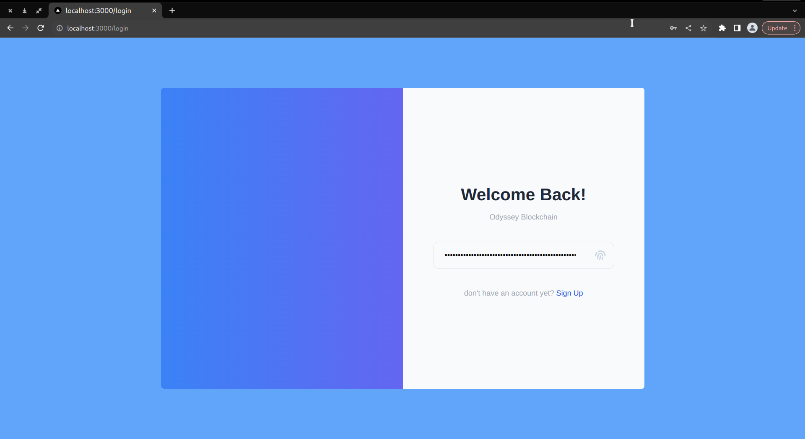
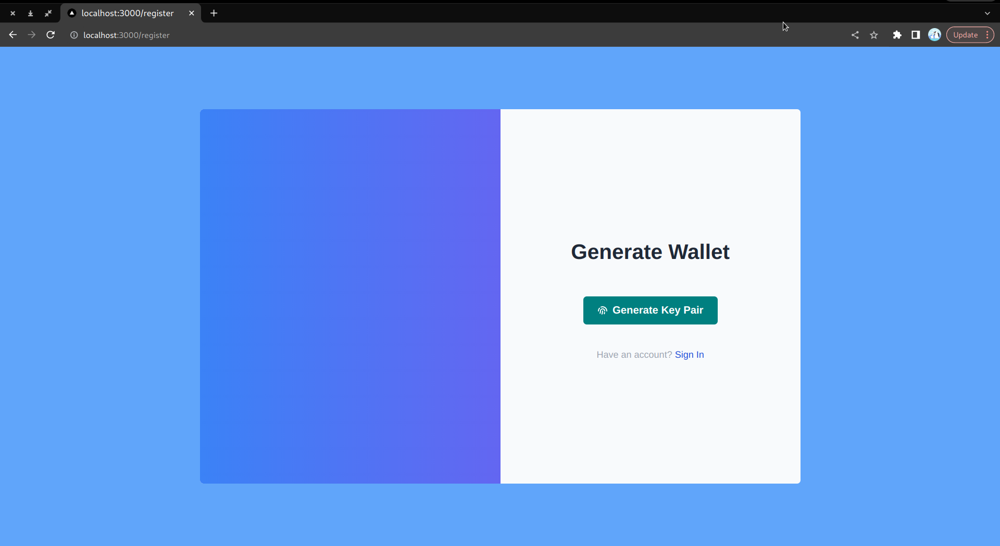
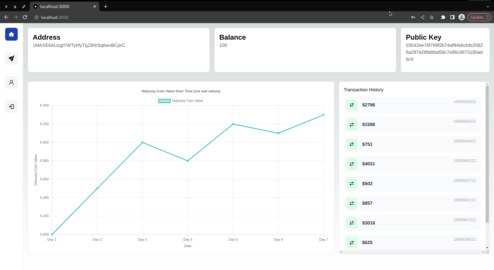
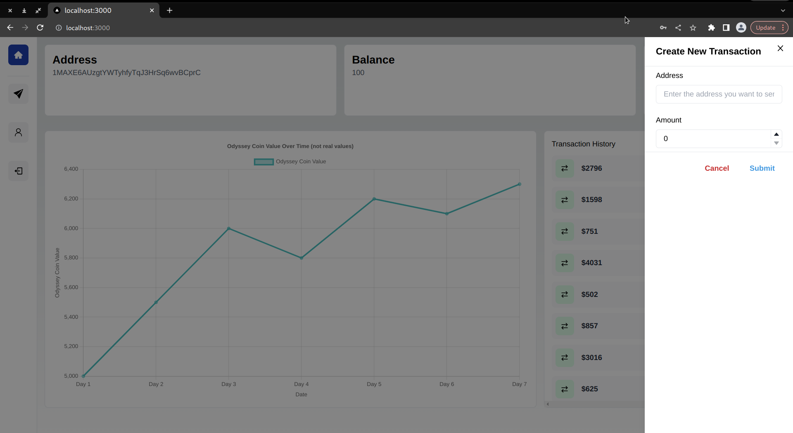
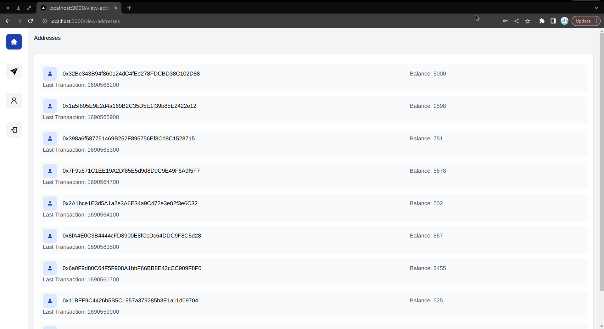

<h1 align="center">

</h1>

<div align="center">
<h2 align="center">A wallet for the oddyssey blockchain</h2>

[](https://www.rust-lang.org/)


[](https://github.com/humblepenguinn/odyssey)
</div>


Welcome to Oddyssey Wallet, a blockchain wallet application built using `TypeScript` and `Next.js` for our custom blockchain called [`oddyssey`](https://github.com/humblepenguinn/odyssey). This wallet allows users to generate `public` and `private` keys, log in with their private keys, and send cash to other users. Additionally, users can view the current value of the coin (which is just a dummy value for now), explore all addresses in the blockchain, and see their previous transactions. Moreover, users can view the latest transaction of a specific address.

Note: This project is still under development, and while it can be used for testing purposes, it may contain bugs. We appreciate any contributions to improve the application and fix any issues.

### [View the Pictures Here](#pictures)

# Server - Built with Rust and Rocket Framework

The server side is written in `rust` using the `rocket` Framework. This `rust` server interacts with the custom blockchain and handles various API requests from the Next.js frontend.

You can find the server code in the server directory. To set up the server, follow these steps:

- Navigate to the server directory.
- Build the project using Cargo:

```bash
cd server
cargo build
```

- Run the server:

```bash
cargo run
```

# Setting Up the Next.js Frontend

To set up the `Next.js` frontend, follow these instructions:

- Ensure you have Node.js and npm installed on your system.
- Open a new terminal and navigate to the root directory of the project.
- Install the dependencies:

```bash
npm install
```

- Start the development server:

```bash
npm run dev
```

Open your web browser and go to http://localhost:3000 to access the Oddyssey Wallet application.

Note: If your Rust server is running on a different URL, you may need to update the Axios post endpoints in the frontend (api.ts file) accordingly to make sure the communication works correctly.

# Features and Future Enhancements

Currently, Oddyssey Wallet is in its early stages, and there may be bugs and limitations. Here are some planned features and future enhancements:

- Improve accuracy of coin value representation.
- Implement a page where users can view the entire blockchain.
- Enhance security and implement more robust authentication mechanisms.
- Improve error handling and user feedback.
-  Add comprehensive documentation to make contributing easier for developers.

# Contribution

While this is primarily a personal toy project, we welcome contributions and bug fixes from the community. If you encounter any issues or have ideas to improve the application, feel free to create pull requests or open issues. However, do note that we may not provide extensive documentation or actively maintain this project since it's not intended for production use.

## License
The project is licensed under the [MIT](LICENSE-MIT) License and the [Apache](LICENSE-APACHE) License.

# Pictures
## Login Page



## Register


## Dashboard


## Transaction


## View Addresses On The Blockchain

